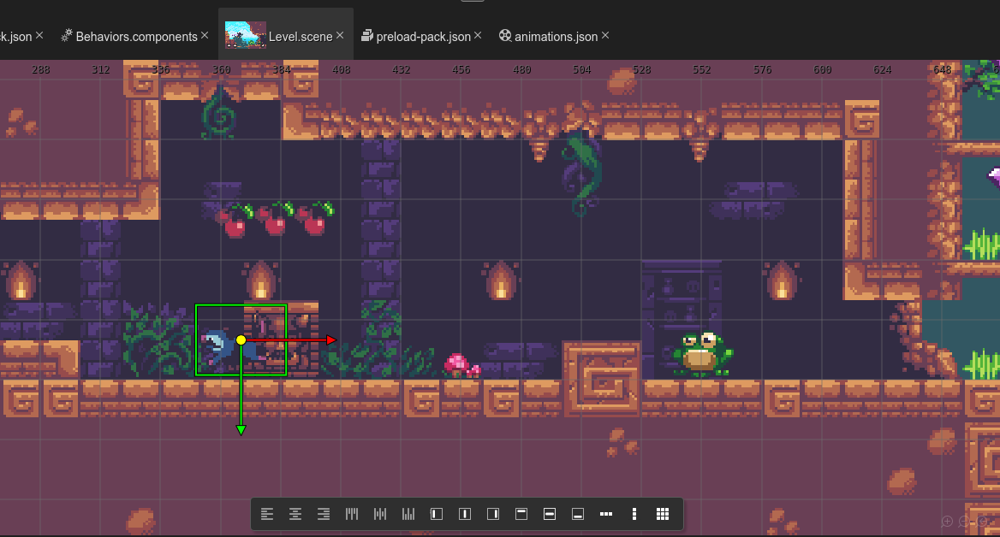

# Sunny Land example game



[](https://gitpod.io/#https://github.com/PhaserEditor2D/starter-example-sunny-land)

This is a port to Phaser 3 of the [Sunny Land demo made by Luis Zuno](https://ansimuz.itch.io/sunny-land-pixel-game-art).

This is a good example of how to use the Tilemap support in the Scene Editor, the User Components and the Animations Editor.

## Configuration

* It includes the latest Phaser v3 runtime (in the `lib/` folder).
* It is coded in JavaScript.
* It includes a VS Code project configuration (`jsconfig.json` file) and the type definitions (in the `types/` folder).

## Run the editor

If you have NodeJS installed, you can run the editor using the `editor` NPM script, defined in the `package.json` file:

```bash
$ npm install
$ npm run editor
```

If you are in a remote environment (like the Gitpod.io IDE), then run the editor like this:

```bash
$ npm run editor-remote
```

If you want to see all the editor options, run:

```bash
$ npx phasereditor2d-launcher -help
```

If Phaser Editor 2D Core is globally installed, you can run:

```bash
$ PhaserEditor2D -project .
```